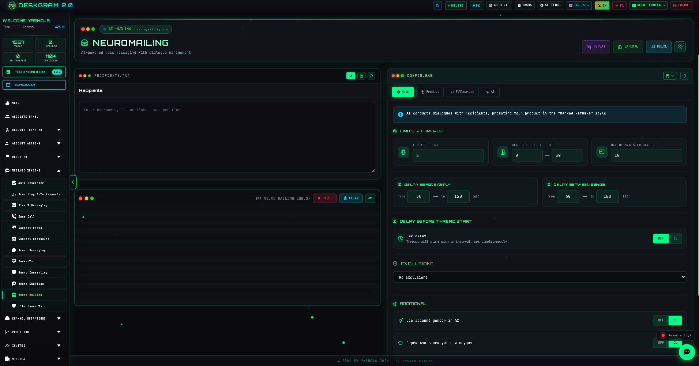
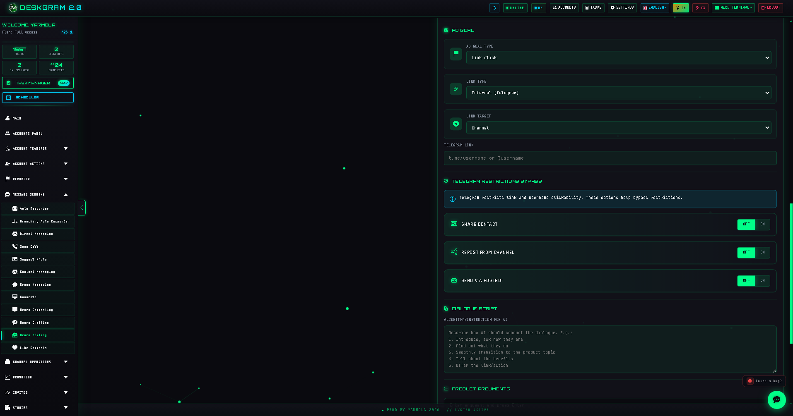
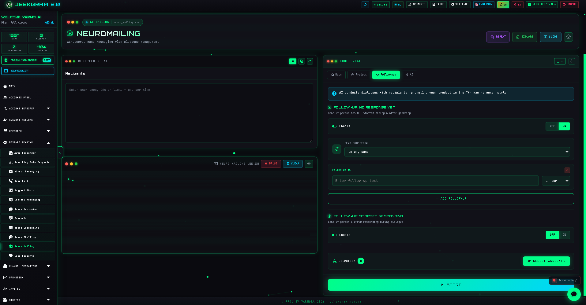
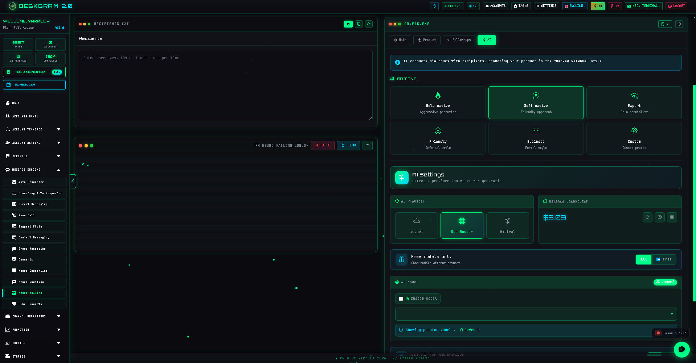

# Telegram Neuro Mailing with Deskgram 2

Telegram Neuro Mailing is a Deskgram 2 module for AI-driven private chat outreach in Telegram. It helps you start conversations, adapt the tone to the offer, continue the dialogue with follow-ups, and move the contact toward a target action instead of stopping after one outgoing message.

[Deskgram 2 Hub](https://github.com/Deskgram-2/deskgram-2-telegram-automation-en) · [Website](https://deskgram2.com/) · [Telegram Bot](https://t.me/DG2welcomebot) · [Web Preview](https://deskgram2.com/web-preview?path=%2Fapp-demo%2Ffunctions%2Fneuromailing)

## Interactive Web Preview

Try the module interface in the browser: [Open web preview](https://deskgram2.com/web-preview?path=%2Fapp-demo%2Ffunctions%2Fneuromailing)

If you want to understand the dialogue flow before installation, start with the browser preview. It is the fastest way to inspect product setup, goal logic, follow-ups, and the AI block without touching local setup yet.

## Interface highlights

### Main workspace

### Product goal

### Follow-ups

### AI settings

## About the module

| Parameter | What is inside |
|---|---|
| Main task | AI-powered private chat outreach in Telegram |
| Core difference | It does not stop at the first message and focuses on the full conversation route |
| Key blocks | Product context, goal logic, follow-ups, AI provider, tone, account pool |
| Useful for | Lead generation, sales conversations, warm outreach, qualification flows |
| Related modules | Direct Messaging, Autoresponder, Audience Parser |

## What it can do

- send personalized first-touch messages into Telegram private chats;
- continue the conversation according to a defined AI strategy;
- adapt wording, tone, and argument order to the product or offer;
- trigger follow-ups when the contact stays silent;
- keep one target action in focus such as reply, lead form, click, or booking;
- work with account limits, delays, and broader infrastructure settings;
- collect statistics around dialogue quality, replies, and conversion signals.

## Quick start

1. Prepare the recipient base.
2. Describe the offer, the target action, and the desired conversation style.
3. Configure follow-ups, exclusions, and AI settings.
4. Assign accounts, pacing, and execution limits.
5. Launch the task and monitor the dialogue quality in the task layer.

## Where this route fits best

- when the offer sells better through conversation than through one static message;
- when reply quality matters more than raw send volume;
- when you want AI to carry the contact from the first touch to a concrete next step;
- when follow-up logic is part of the conversion plan from the start.

## What to connect before and after launch

- [Audience Parser](https://github.com/Deskgram-2/telegram-audience-parser-deskgram-en) if you still need a recipient base.
- [Account Manager](https://github.com/Deskgram-2/telegram-account-manager-deskgram-en) if the campaign uses different account groups for different offers.
- [Proxy Manager](https://github.com/Deskgram-2/telegram-proxy-manager-deskgram-en) if infrastructure stability matters for a longer dialogue route.
- [Automation Settings](https://github.com/Deskgram-2/telegram-automation-settings-deskgram-en) if the scenario depends on shared AI and system-level configuration.
- [Task Manager](https://github.com/Deskgram-2/telegram-task-manager-deskgram-en) if you want one place to track execution, reply volume, and failures.
- [Autoresponder](https://github.com/Deskgram-2/telegram-autoresponder-deskgram-en) if incoming replies should continue through a background reply layer.

## What to choose: Neuro Mailing or Direct Messaging

| If your goal is | Better fit |
|---|---|
| Run controlled bulk outreach with message constructor logic | [Direct Messaging](https://github.com/Deskgram-2/telegram-direct-messaging-deskgram-en) |
| Build a more conversational AI route in private chats | [Neuro Mailing](https://github.com/Deskgram-2/telegram-neuro-mailing-deskgram-en) |
| Reach the full base first and deepen selected replies later | Direct Messaging first, then Neuro Mailing |
| Keep a reply layer active after the initial AI route | Neuro Mailing with [Autoresponder](https://github.com/Deskgram-2/telegram-autoresponder-deskgram-en) |

## Scenario FAQ

### Can I inspect the module before installing Deskgram 2?

Yes. The README already includes a direct browser preview, so you can open the interface, review the product block, follow-up logic, and AI settings before installation.

### When is Neuro Mailing stronger than a standard outreach module?

It becomes stronger when the result depends on the conversation itself, not only on message delivery. If the offer needs clarification, persuasion, or follow-up logic, Neuro Mailing is the better route.

### Do I need follow-ups here or can I work with a single AI message?

You can start with one message, but follow-ups usually make the module more valuable. They help revive quiet leads and keep the conversation moving toward the target action.

### What should I prepare before launching the scenario?

At minimum, prepare the recipient base, the offer context, the target action, and a clean AI tone. Then configure limits, account assignment, and reply handling before launch.

## Related repositories

- [Deskgram 2 Hub](https://github.com/Deskgram-2/deskgram-2-telegram-automation-en)
- [Direct Messaging](https://github.com/Deskgram-2/telegram-direct-messaging-deskgram-en)
- [Audience Parser](https://github.com/Deskgram-2/telegram-audience-parser-deskgram-en)
- [Autoresponder](https://github.com/Deskgram-2/telegram-autoresponder-deskgram-en)
- [Account Manager](https://github.com/Deskgram-2/telegram-account-manager-deskgram-en)
- [Proxy Manager](https://github.com/Deskgram-2/telegram-proxy-manager-deskgram-en)
- [Automation Settings](https://github.com/Deskgram-2/telegram-automation-settings-deskgram-en)
- [Task Manager](https://github.com/Deskgram-2/telegram-task-manager-deskgram-en)

## Useful links

- [Deskgram 2 website](https://deskgram2.com/)
- [Deskgram 2 Telegram bot](https://t.me/DG2welcomebot)
- [Open neuro mailing web preview](https://deskgram2.com/web-preview?path=%2Fapp-demo%2Ffunctions%2Fneuromailing)
